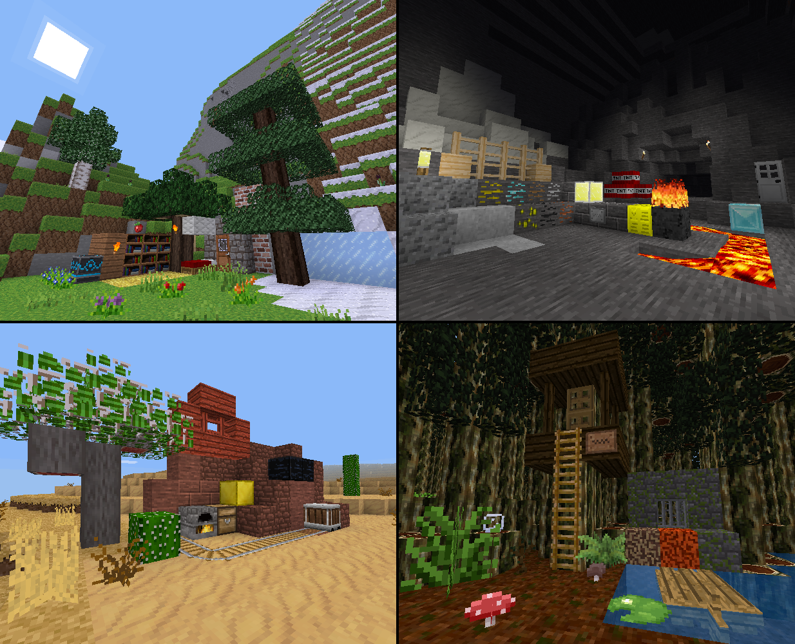

# Texture-Pack-Template
A Template for voxel game texture packs built to keep things consistent and descriptive in the community

Uses [minetest](https://github.com/minetest/minetest) worlds and fairly generic blocks for multi-game compatibility.

# How to Use
## Step one:
Take the screenshots using the worlds given(Hide the HUD!). Make sure the screenshots taken are in aspect of 1235 pixels wide and 1000 pixels high. Note:(if you moved in the world, and need to restart, copy the text in the past_pos_*.txt near the world folders then paste into your character text file and restart the world)

## Step two:
Open your screenshots in your chosen image editor along with the TemplateBG.png provided.

## Step three:
Paste the screenshots into the Template image and scale them down to 615X498, be sure that interpolation is off, then move them to their equivalent locations.

## Step four:
Export the final image as a new file for your use.

### Important Notes
Freeze time before use, they have the sun in the right spot.

There is coral in the jungle world that will periodically die, and will need to be replaced.(Just use the paste_pos to get back)

The desert world has a lit furnace that will periodically need to be relit with coal.

The grassland world should have the sun visible, so probably wait till the clouds clear.
